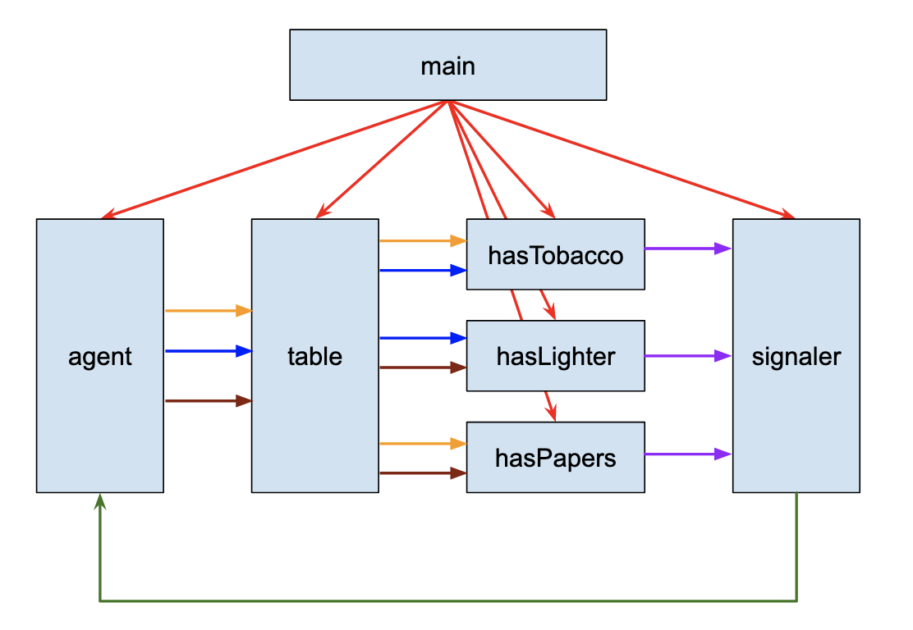

## Three Smoker's Problem

From the [Wiki page](https://en.wikipedia.org/wiki/Cigarette_smokers_problem):

Assume a cigarette requires three ingredients to make and smoke: tobacco, paper, and a lighter. There are three smokers around a table, each of whom has an infinite supply of one of the three ingredients — one smoker has an infinite supply of tobacco, another has paper, and the third has a lighter.

There is also a non-smoking agent who enables the smokers to make their cigarettes by arbitrarily (non-deterministically) selecting two of the supplies to place on the table. The smoker who has the third supply should remove the two items from the table, using them (along with their own supply) to make a cigarette, which they smoke for a while. Once the smoker has finished his cigarette, the agent places two new random items on the table. This process continues forever.

## Solution

This solution splits the problem into five sub-problems:

- an agent
- a table
- three smokers

The agent simply supplies two smoking components to the table. The table implements the business logic to gather the components
and pass them to the correct smoker.
